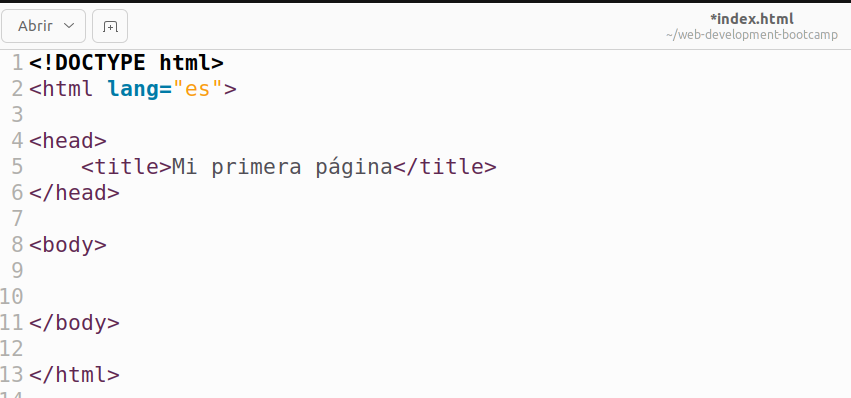
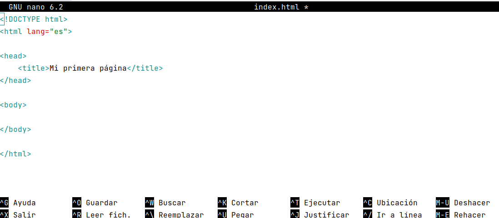
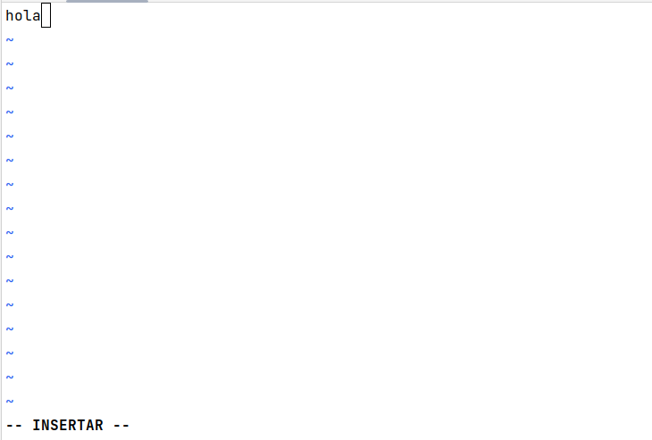
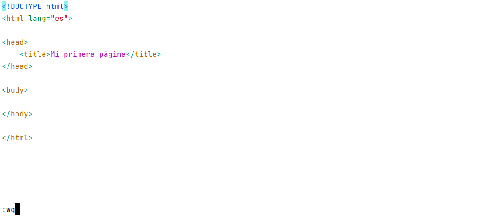

# Editores de texto

## Windows

En Windows podemos utilizar el bloc de notas o notedap++ que incluye algunas funciones adicionales con las que no cuenta el bloc de notas.

### Bloc de notas

#### Editar archivos

Para editar un archivo, desde el explorador navegamos a nuestro archivo deseado, damos clic derecho, abrir con -> Elegir otra aplicación y buscamos el Bloc de notas.

Añadimos el siguiente contenido, que representa la estructura básica de una página en HTML5, y guardamos el archivo.

## Linux y macOS

### gedit

gedit es un editor de textos compatible con Linux, macOS y Windows. Es el editor por defecto en Ubuntu.

#### Instalación

##### Linux

Si estamos en Ubuntu no necesitamos hacer nada para instalarlo.

##### macOS

Para instalarlo utilizaremos Homebrew.

Primero procederemos con la instalación de Homebrew (puedes encontrar los detalles actualizados de la instalación en
su [sitio oficial](https://brew.sh/)), abrimos una terminal y ejecutamos lo siguiente:

`/bin/bash -c "$(curl -fsSL https://raw.githubusercontent.com/Homebrew/install/HEAD/install.sh)"`

Una vez que tenemos instalado Homebrew, procedemos a instalar gedit, para ello ejecutamos, en la misma o en otra
terminal, el siguiente comando

`brew install gedit`

#### Editar archivos

Para editar un archivo, desde el explorador navegamos a nuestro archivo deseado y damos doble clic para abrirlo.

Añadimos el siguiente contenido, que representa la estructura básica de una página en HTML5, y guardamos el archivo.

### nano

nano (oficialmente GNU nano) es un editor de texto para sistemas UNIX (por ejemplo Linux y macOS).

#### Editar archivos

Para utilizar nano primero nos diriguiremos a la carpeta donde hayamos creado nuestro archivo, para ello utilizaremos el
comando:

`cd web-development-bootcamp`

Para abrir nuestro archivo con vim ejecutaremos el siguiente comando:

`nano index.html`

Y se nos abrirá el editor en nuestra terminal

Añadimos el siguiente contenido, que representa la estructura básica de una página en HTML5, y guardamos el archivo
presionando la tecla `ctrl` y la letra `O` al mismo tiempo.

Para cerrar el editor presionamos la tecla `ctrl` y la letra `X` al mismo tiempo.

### vim

Vim (del inglés Vi IMproved) es una versión mejorada del editor de texto Vi, presente en todos los sistemas UNIX (por
ejemplo Linux y macOS).

#### Editar archivos

Para utilizar vim primero nos diriguiremos a la carpeta donde hayamos creado nuestro archivo, para ello utilizaremos el
comando:

`cd web-development-bootcamp`

Para abrir nuestro archivo con vim ejecutaremos el siguiente comando:

`vim index.html`

Y se nos abrirá el editor en nuestra terminal

Para entrar en modo edición presionamos la tecla `i` que nos pondra en el modo insertar

Añadimos el siguiente contenido, que representa la estructura básica de una página en HTML5, y guardamos el archivo.
Presionamos la tecla `escape (esc)`, escribimos `:wq` y presionamos `enter`,
donde la `w (write)` nos indica que escribiremos los cambios y la `q (quit)` sera para cerrar vim.

